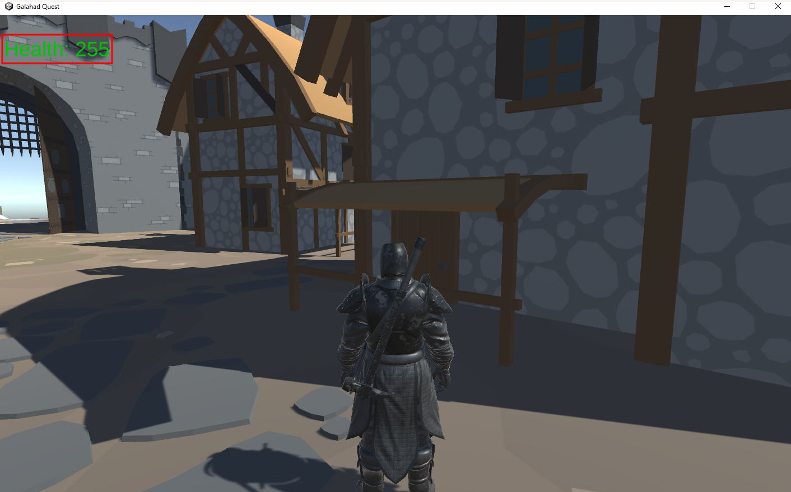
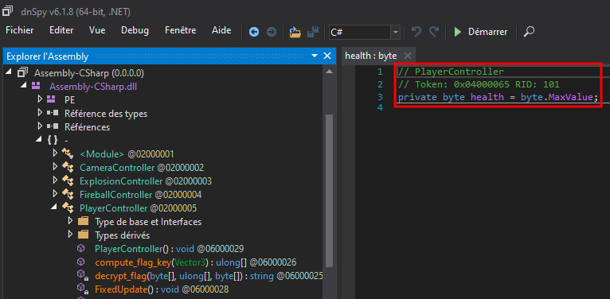
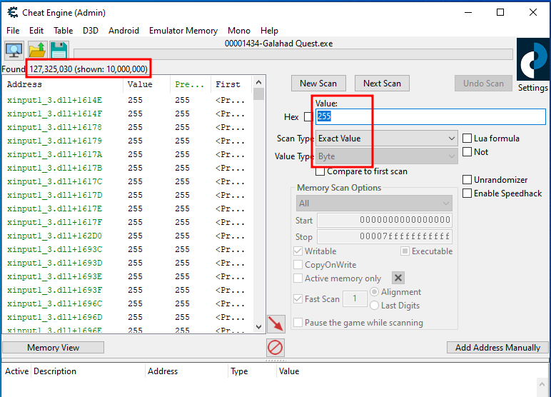
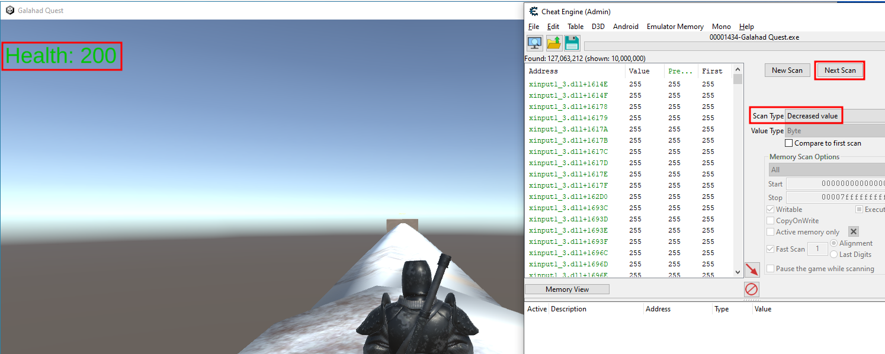
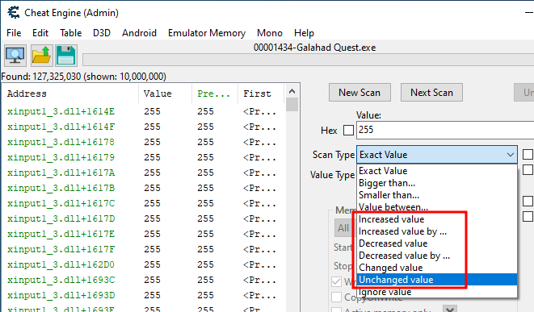
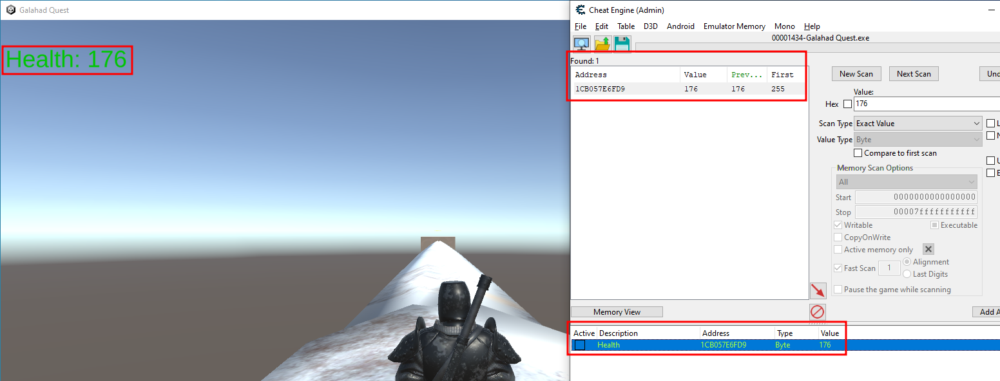

+++ 
draft = true
date = 2024-05-28T17:56:11+02:00
title = "Breizh ctf 2024 - Write-up - Game Hacking"
description = ""
slug = "bzhctf2024-wu-gamehacking"
authors = ["sillawned"]
tags = ["CTF", "Game Hacking"]
+++

## Introduction

Cette année, les organisateurs du Breizh CTF nous ont proposé des challenges dans la catégorie Game Hacking. Un jeu a été spécialement conçu pour l'évènement : "Galahad Quest". Le moteur graphique Unity a été utilisé pour l'occasion.

## Challenges

L'auteur [HellDiner](https://github.com/h311d1n3r) a caché dans la mémoire du jeu 4 flag : 

1. Only Up!  
	_Aidez Galahad, le plus jeune chevalier de la Table ronde, à mener sa quête au travers de différentes missions. Pour le premier de ses 4 travaux, le fils de Lancelot du Lac doit se hisser sur la tour la plus haute du village. Seulement, malgré une capacité de saut défiant les lois de la physique, la tour semble bien inaccessible. À moins que..._
2. Age of Fire  
	_Pour cette seconde tâche, Galahad a pour mission d'allumer une torche placée devant l'entrée du village menant au dangereux "Pont de l'épée". Pour mener à bien sa mission, Merlin lui a confié un puissant sort permettant de tirer des boules de feu. Mais notre héros a oublié comment le déclencher... Aidez-le à retrouver la mémoire et à lancer son sort sur la torche pour l'enflammer._
3. The Sword Bridge  
	_Vous voici rendu à la troisième mission de notre chevalier. Afin de mener à bien cette dernière, Galahad doit rejoindre la plateforme située au bout du légendaire "Pont de l'épée". Mais n'imaginez pas qu'un sort de téléportation puisse suffire, il est nécessaire que Galahad marche sur le pont. Sinon, le secret ne vous sera pas dévoilé..._
4. A well-kept secret  
	_Vous voici arrivé à l'ultime tâche de Galahad, et cette dernière est tout sauf aisée : retrouver la puissante Excalibur, l'épée du Roi Arthur. Ce dernier l'a perdue quelque part sur la carte. Malheureusement, loin de son maître, l'arme est devenue invisible. Vous devez donc rentrer en contact avec un objet invisible, perdu à un endroit quelconque..._

## Résolution

_Disclaimer : le write-up a pour but d'aborder une méthodologie générale sur le game hacking, et non la technique la plus optimisée pour résoudre ces challenges._

### Only Up!

L'objectif de ce challenge est "simple"[^1] : placer notre personnage en haut de la plus haute tour pour récupérer le premier flag.

[^1]: Easy challenge.

La première chose que l'on observe en lançant le jeu est la vie du personnage en haut à gauche de l'écran : **Health: 255**.

Au niveau des contrôles on note :
- avancer/reculer (touches Z/S),
- tourner la caméra droite/gauche (touches Q/D),
- sauter (touche espace),
- caméra à 180° (clic droit de la souris).

En explorant la zone on se rend compte que les contrôles à notre disposition ne suffisent pas pour nous rendre en haut de la plus haute tour. Il va falloir mettre les mains dans la mémoire du jeu pour arriver à nos fins.

#### Recherche de l'adresse mémoire de la vie

Pour cette étape nous allons utiliser [Cheat Engine](https://github.com/cheat-engine/cheat-engine) et [dnSpy](https://github.com/dnSpy/dnSpy).

En ouvrant le fichier `Galahad_Quest\Galahad Quest_Data\Managed\Assembly-CSharp.dll` dans dnSpy, nous identifions le type `byte` pour la variable `health` et elle est initialisée à `byte.MaxValue`, i.e 255.

Dans Cheat Engine nous allons donc rechercher la valeur `255` (ou `FF` en hexadécimal) de type `Byte` dans le processus `Galahad Quest`.

La première itération remonte un grand nombre de valeurs (~127 millions) et évidemment nous n'allons pas passer sur chaque valeur à la main pour trouver la bonne adresse.
Cheat Engine dispose d'un panel de type de scans pour affiner notre résultat. Dans notre cas nous allons utilisé de façon aléatoire mais logique les scans suivants :
- Unchanged value,
- Changed value (ou Decreased/Increased pour un affinage plus rapide).

_Notabene: le scan 'unchanged' est utilisé lorsque la valeur de la vie n'a pas changé, et inversement pour les autres scans._

Hints pour modifier la vie

La vie change sur l'épée (ne pas aller trop loin pour les premiers scans). 

Après plusieurs itérations nous obtenons l'adresse de la variable `health`, qui appartient à la structure `PlayerController` (cf. dnSpy).

_Notabene: Nous obtenons une adresse dynamique, c'est-à-dire qui sera différente à chaque lancement du jeu (et donc cela implique de refaire le processus de recherche à chaque relancement). Pour les plus curieux, Cheat Engine représente les adresses statiques avec une couleur verte. Libre à vous de remonter la chaîne des pointeurs pour trouver une adresse statique (spoiler: je ne l'ai pas fait)._

Cependant, nous n'avons pas encore de moyen d'aller en haut de la plus haute tour à ce stade.
Pour cela, nous allons rechercher l'offset de la variable health au sein de la structure via le debugger de Cheat Engine : clic droit sur l'adresse et `Find what write to this address (F6)`.

#TODO
1. Screenshot de la fonction et montrer l'offset (0xF9)
2. Observer la mémoire aux alentours et trouver l'offset de 'on_ground'
3. Freeze la valeur de 'on_ground' pour sauter à l'infini
4. Se rendre sur la plus haute tour

### Age of Fire

L'objectif est d'allumer la torche située à côté de l'entrée du village avec le sort `boule de feu`.

Maintenant que notre setup de hack est mis en place, ce challenge et le suivant seront plus rapide. En retournant sur dnSpy on constate que la condition pour débloquer le sort sur le clic droit dépend de la variable `some_bool` de type `Byte`, et que celle-ci est "proche dans la mémoire" par rapport à la variable `health`.

#TODO

### The Sword Bridge

### A well-kept secret

## Ressources annexes
